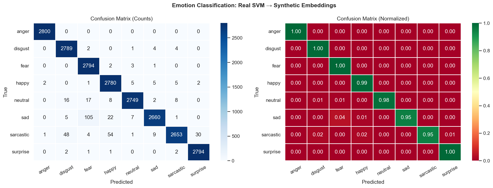
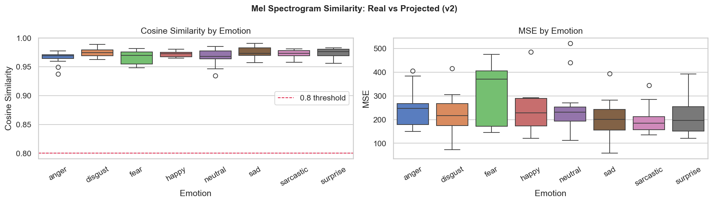
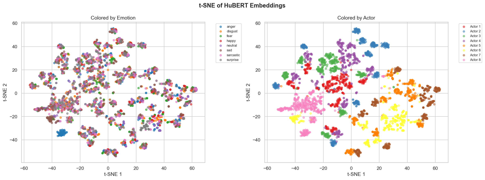

# Improving Hindi Speech Emotion Recognition using Synthetic Data


---

## 🧠 Overview
This project focuses on **Speech Emotion Recognition (SER) in Hindi**, a low‑resource language with limited annotated datasets.  
We developed a pipeline for **synthetic voice data generation** using **HuBERT embeddings** and **Gaussian interpolation**, enabling robust emotion classification across multiple models.  

The system improves generalization across unseen speakers and sentences, addressing the scarcity of high‑quality Hindi SER datasets.

---

## ⚙️ Features
- **Synthetic Data Generation** using Gaussian interpolation on HuBERT embeddings.  
- **Emotion‑consistent augmentation** that preserves fidelity across emotion classes.  
- **Baseline models**: SVM, CNN, LSTM, ResNet, Transformer Encoder.  
- **Hybrid Transformer‑CNN** architecture with feature fusion for improved accuracy.  
- **Validation metrics**: Fréchet distance, cosine similarity, LOSO/LOAO generalization tests.  

---

## 📸 Demo





---

## 🛠 Installation
Requires **Python 3.9+**.  

Clone the repository:
```bash
git clone https://github.com/Aaditya-Jain-01/Improving-Hindi-Speech-Emotion-Recognition.git
cd Improving-Hindi-Speech-Emotion-Recognition
```

# Install dependencies
```bash
pip install -r requirements.txt
```

# Run training
```bash
python train_transformer_cnn.py --data ./data/augmented
```

## ▶️ Usage
Run training with augmented dataset:
```bash
python train_transformer_cnn.py --data ./data/augmented
```

Expected output example:
```
Epoch 10 | Macro F1: 0.74 | Accuracy: 78%
```

---

## 📊 Results
| Model              | Macro F1 | Accuracy |
|--------------------|----------|----------|
| CNN (baseline)     | 0.62     | 62%      |
| LSTM (baseline)    | 0.59     | 59%      |
| ResNet (baseline)  | 0.61     | 61%      |
| Transformer‑CNN    | 0.74     | 78%      |

- **Gaussian interpolation** preserved emotional fidelity (validated via Fréchet distance & cosine similarity).  
- **Augmented dataset** improved generalization across unseen speakers and sentences.  

---

## 📚 References
This project builds upon research in **Speech Emotion Recognition (SER)** and synthetic data augmentation for low‑resource languages.  
Key techniques: HuBERT embeddings, Gaussian interpolation, Transformer‑CNN hybrid architectures.  

---

## 👨‍💻 Author
**Aaditya Jain**

### My Role
- Designed and implemented the Gaussian interpolation pipeline.  
- Integrated HuBERT embeddings for synthetic augmentation.  
- Conducted Transformer‑CNN experiments and performance analysis.  
- Organized and documented the repository for recruiter presentation.  

---

## 🪪 License
Licensed under the **MIT License**.

